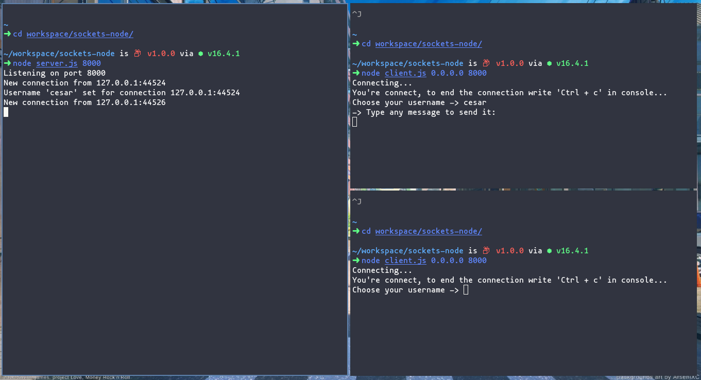
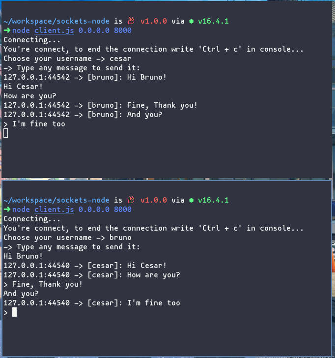

# Sockets with NodeJS





# Install

```
git clone https://github.com/cesaralvarod/sockets-nodejs
```

# Using

```
cd sockets-nodejs
```

## Connecting with the server

```
node server.js port
```

## Client - Server

```
node client.js host port
```

### Inspired by

- [4tomik](https://github.com/4tomik/sockets-node)
